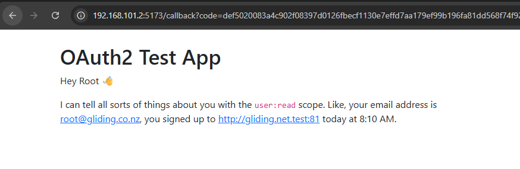

# gliding.net.nz PKCE OAuth2 client PoC

This repo shows an OAuth2 PKCE client implementation that loads aircraft from gliding.net.nz. It demonstrates an OAuth2 integration with Laravel Passport.

## Installation
1. Have [the gliding.net.nz project](https://github.com/glidingnz/58gliding.net.nz) running locally
2. Inside of the gliding.net.nz project, run `make console` to get a CLI
    1. Run `php artisan passport:client --public` to setup a new client
    2. For "What should we name the client?", name it something distinctive
    3. For "Where should we redirect the request after authorization?", put the URL of your client e.g. http://localhost:5173/callback or http://192.168.101.2:5173/callback (running in my VM).
    4. For "Would you like to enable the device authorization flow for this client?", leave it as "no".
    5. Store the generated client ID and client secret in `config.ts` in this project
    6. Ensure the origin for your test web app is added to `./config/cors.php` in the gliding.net.nz project
3. In this project, update the contents of `./src/config.ts`
    1. Set `remoteBaseUrl` to the URL of your local gliding.net.nz
    2. Set `clientId` to the one generated above
    3. Set `redirectUri` to the URL of your app with the `/callback` path
3. Run `npm i` to install the dependencies
4. Run `npm run dev`. If you want to expose this outside of localhost, you will need to specify the interface e.g. `npm run dev -- --host 192.168.101.2`.
5. Visit the URL in your browser

## Expected flow
1. You are redirected to your local version of gliding.net.nz to authenticate
2. You enter your username and password
3. You complete an MFA challenge
4. You authorize the client its requested scopes
5. You are redirected back to the client app
6. The client app hits the API with its new token to fetch user information, which it renders on the page.

## FAQ

Q. When I load the client app, I see `Error: Failed to fetch`. When I look at the developer console, my local gliding.net.nz returned `HTTP 401`.

A. Ensure that you added the web app's origin to `./config/cors.php` in your local gliding.net.nz.

---

Q. When I load the client app, I see `No user data available`. When I look at the developer console, I see `Error: The context/environment is not secure, and does not support the 'crypto.subtle' module.`

A. If you are using Google Chrome, you can go to `chrome://flags/#unsafely-treat-insecure-origin-as-secure`, enter the URL of the client, and click `Relaunch` to relaunch your browser.

---

Q. Can I validate this against production?

A. Yes! In `config.ts` set the client ID `019f8910-6d52-71c5-95e4-945fa1139039` and `remoteBaseUrl` as `https://gliding.net.nz`.
